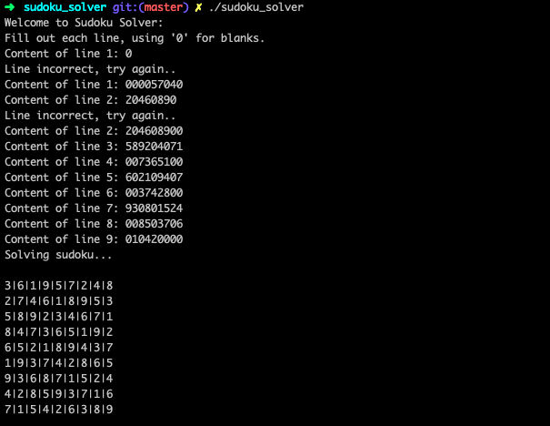

# Sudoku Solver

Simple sudoku solver created in C using only write() and, malloc() and free(), functional for all valid sudokus.

## Installation and usage

```
git clone https://github.com/andrewrzepecki/sudoku_solver.git & cd sudoku_solver & make
```

Execute the program and enter each line of sudoku to solve, replacing blanks by '0' characters.
If mistake has been made type 'undo' to go back a line.


